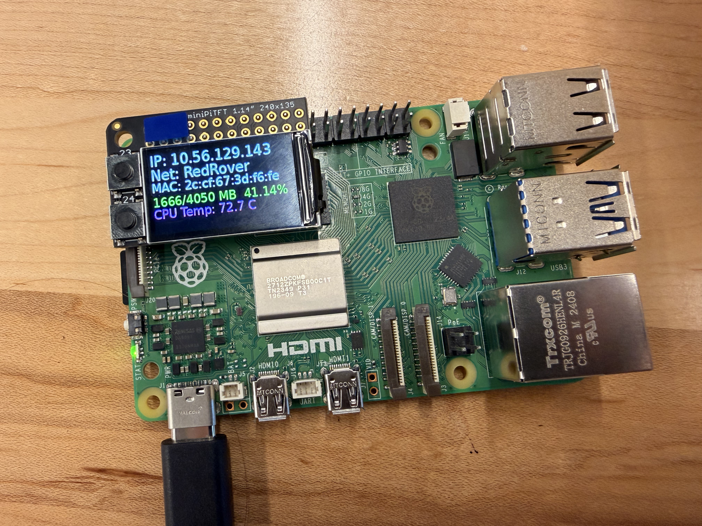
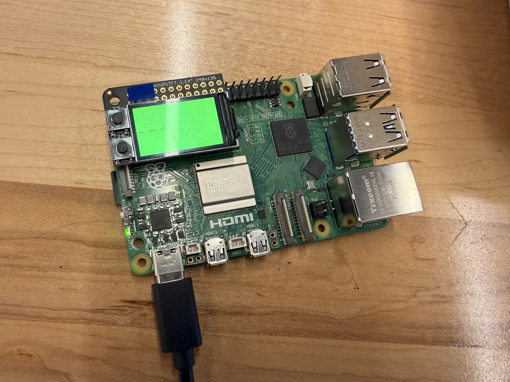
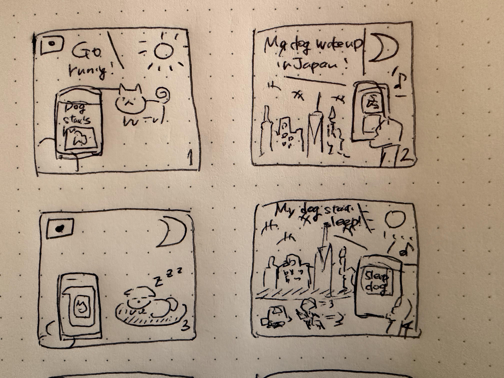

# Interactive Prototyping: The Clock of Pi
**Yuri Mukai**

I joined this course partway through the semester, so I worked on this lab individually.

I used GitHub Copilot (WendyTA) for help with the display layout code, for debugging GPIO errors, and for refining the English wording of the comic-style messages. The concept, the design decisions, and the choices about what the clock should express are my own.

## Part A. Connect to your Pi

Connected to the Pi over SSH and set up the Python virtual environment.

## Part B. Try out the Command Line Clock

Cloned my forked repository onto the Pi, installed the requirements, and ran `cli_clock.py` successfully.

## Part C. Set up your RGB Display

***Include a picture of your own Raspberry Pi displaying the piscreen.service with your unique MAC address. Additionally, please provide another picture showing the successful completion of the screen test.***

The Pi running `piscreen.service`, showing the IP address, network, and MAC address:

The screen test, showing a color displayed after pressing a button:

## Part D. Set up the Display Clock Demo

Filled in the while loop in `screen_clock.py` to display the current time on the MiniPiTFT.

[Basic clock video](clock_basic.mov)

## Part E. Sketch and brainstorm

I started by thinking about how time actually feels. It stretches and shrinks depending on whether I am enjoying something, or how deeply I am concentrating. But a feeling is hard to count. I wanted something countable, something that happens every day without fail.

Coffee was an obvious answer. I drink it twice, morning and afternoon. But that felt too flat to build a clock around.

So I looked at my own daily life instead. When I lived in Japan, my dog woke me up early every morning demanding a walk. At night, when he started looking sleepy, I got sleepy too. He was my clock, and I never thought of him that way.

Now I live in NY, and the time difference is almost exactly twelve hours, so our days are inverted. My parents send me photos: the dog waking them up in the Japanese morning, or the dog starting to fall asleep in the Japanese night. Each time a photo arrives, I do not read it as "it is morning there." I feel that night is coming here, or that morning has arrived here.

That became the idea for my clock. It does not display time as a number to be read. It displays time as something that arrives from somewhere else, through a living thing that has no idea what a time zone is. The dog simply wakes up, asks for a walk, and gets sleepy. Those ordinary moments are still my clock, even from the other side of the world.

### The prototype

The idle screen shows two clocks, NY and Japan, with a photo of the dog. Two cues on the left, drawn with simple shapes, indicate what each button does.

Pressing a button stands in for a photo arriving through a messaging app. This is a Wizard of Oz approach: the event I want to prototype is the arrival of the photo, not the messaging API behind it.

- **Top button** — A photo arrives showing the dog waking my parents up in the Japanese morning. For me, that means the day here is ending. The screen answers: ~~GOOD NIGHT, AMERICA!~~ **Welcome to the city that never sleeps!**
- **Bottom button** — A photo arrives showing the dog starting to fall asleep in the Japanese night. For me, that means morning is arriving. The screen answers: **GOOD MORNING, AMERICA!**

Each scene plays in two panels. The photo appears alone first, filling the screen with a short caption saying a photo has arrived from Japan. A second later, the photo clears and the comic message takes the whole screen on its own.

I joined the course partway through the semester and worked on this lab individually, so I did not exchange feedback with classmates for this round.

# Lab 2 Part 2

## Modify the barebones clock to make it your own

For the first modification I changed the colors and typography: a light blue background with mocha brown text, in a rounder font at a larger size.

***Put a copy of your code in your Lab 2 Github repo.***

The code is in `screen_clock.py` in this folder.

## Make a short video of your modified barebones PiClock

***Take a video of your barely modified PiClock.***

[Barely modified PiClock](clock_modified.mov)

## Now, make your own PiClock

The finished clock keeps the two-timezone idle screen and adds the two button scenes described in Part E. Each scene shows the photo alone first, then the comic message on its own, so it reads like two panels rather than one crowded frame.

***Put a copy of your code in your Lab 2 Github repo.***

The code is in `screen_clock.py` in this folder.

***Take a video of your PiClock.***

[My PiClock](piclock_final.mov)